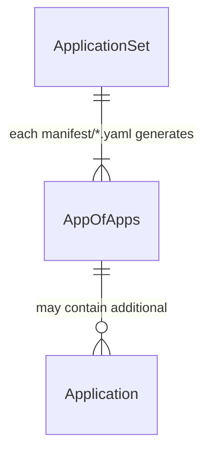
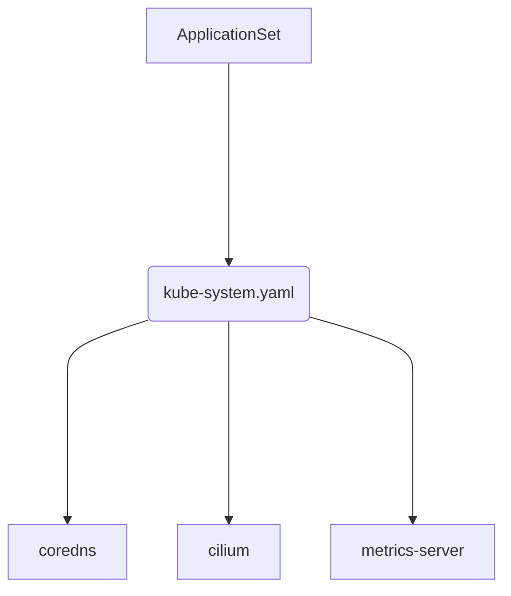

# Overview

GitOps driven homelab using ArgoCD with a flat repository structure.

# Project Structure

```
.
├── .github/                   # Github related files
│   └── renovate.json5         # RenovateBot configuration
├── .vscode/                   # Visual Studio Code configs
│   ├── extensions.json        # Extension recomendations
│   └── settings.json          # Project specific settings
├── docs/                      # Documentation
│   ├── faq.md                 # Frequently Asked Questions
│   ├── netowrk.md             # Networking details
│   └── setup.md               # Installation steps
├── manifest/                  # Watched by ArgoCD ApplicationSet
│   └── $namespace.yaml        # Per namespace, App of Apps
├── .gitignore                 # Ignored files list
└── README.md                  # This file
```

# ArgoCD Structure
An ApplicationSet dynamically generates an Applications for each yaml file inside of the manifest directory.  That Application is AppOfApps, mirroring the filename that it was generated from.  That AppOfApps may contain child Application resources for deploying Helm charts.

<table>
<tr>
<th>Logical</th>
<th>Rendered Example</th>
</tr>
<tr>
<td>
  

  
</td>
<td>



</td>
</tr>
</table>

# Docs
* [application](docs/application.md)
* [faq](docs/faq.md)
* [setup](docs/setup.md)
* [network](docs/network.md)